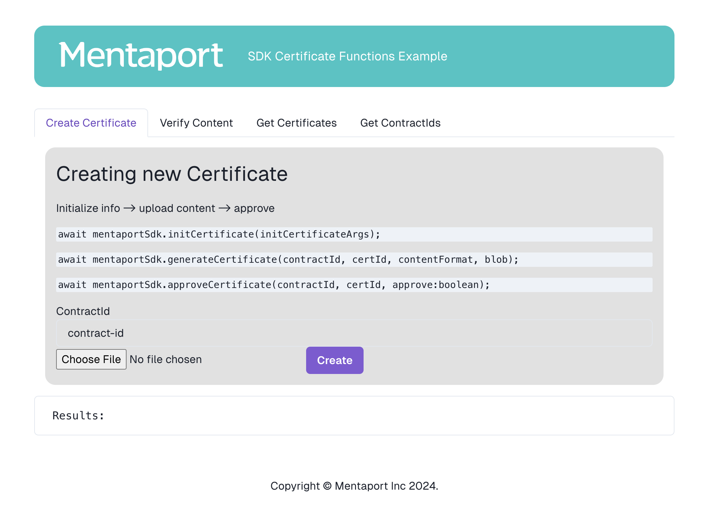

# Mentaport NextJs SDK Example

> 
## Getting Started

Inside *src/app/actions/mentaport*, you will find how to initialize the SDK, call all the main functions, and visualize the results.

>*SDK Version: `1.1.9`*
>
>Make sure to add your **API Key** in the *.env*  
> Add a `contractId`. If you're unsure, find it under the Get *ContractId Tab*
> <br/>
> 



Run the development server:
```bash
# install
npm install

# run
npm run dev
# or
yarn dev

```

Open [http://localhost:3000](http://localhost:3000) with your browser to see the result.


## Learn More
[Mentaport Documentation](https://docs.mentaport.com)

This is a [Next.js](https://nextjs.org) project bootstrapped with [`create-next-app`](https://nextjs.org/docs/app/api-reference/cli/create-next-app).