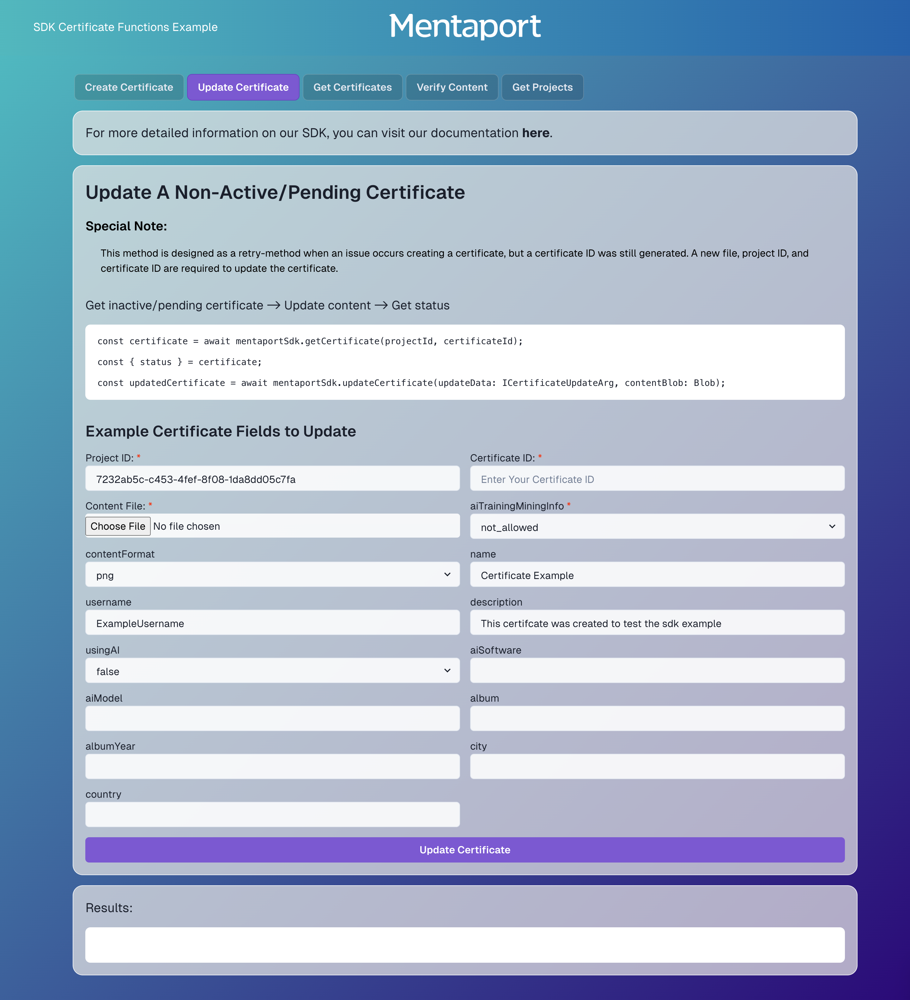
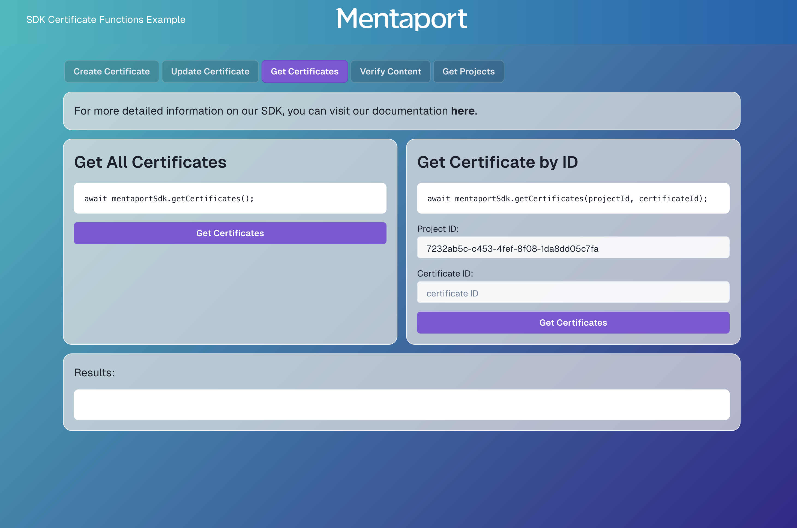

<div align="center">
  
</div>

# Mentaport NextJS SDK Example

This is a [Next.js](https://nextjs.org) project bootstrapped with [`create-next-app`](https://nextjs.org/docs/app/api-reference/cli/create-next-app) showing example usage of Mentaport's official SDK.

You will find how to initialize the SDK, call all the main functions, and visualize the results inside
`src/app/actions/mentaport`. Code for UI and input handling can be found inside `src/components/tab-section`.

> Using Latest SDK Version: [`1.3.0-alpha.5`](https://www.npmjs.com/package/@mentaport/certificates)
> NodeJS: v18.0+

## Environment Variables

To run this project properly, you will need to add the following environment variables to your `.env` file. You can get all variables from your Settings Page in the Mentaport Certificate App website.

```
NEXT_MENTAPORT_API=your_api_key
NEXT_PUBLIC_PROJECT_ID=your_project_id
```

## Run the Example Locally

Go to the project directory

```bash
  cd packages/nextjs-certificates-example
```

Install dependencies

```bash
  npm install
    # or
  yarn install
```

Start the server

```bash
  npm run dev
    # or
  yarn dev
```

To interact with the Example, open [http://localhost:3000](http://localhost:3000) with your browser.

## Example Usage

There are 5 SDK usage examples to interact with:

    1. Create a New certificate
    2. Update a Failed/Non-Active Certificate
    3. Get Existing Certificate(s)
      - Get total count of certificates
      - Get all certificates
      - Get certificates with optional parameters 
          (pagination, by id etc)
    4. Verify Downloaded Content
    5. Get My Project(s)

### Creating a New Certificate

This example lets you interact will all required and optional parameters to create a new certificate using your project ID and API Key.


### Updating a Failed/Non-Active Certificate

This example lets you interact with updating a certificate that failed to approve due to pre-existing certificate/internal error.



### Fetching Specific/All certificates

This example demonstates example usage and results of how to fetch specific and all certificates belonging to the current user.



### Verifying Downloaded Content

This example demonstates an example usage and results of selecting a local file to upload and check for a pre-existing certificate


### Fetching A User's Projects(s)

This example demonstates an example usage and results of fetching for the existing user's projects based on the API key.


## Support
[Mentaport Documentation](https://docs.mentaport.com)

[Join us on Telegram](https://t.me/+JtMHlFyUaJwwY2Nh)

[Join us on Discord](https://discord.gg/cU8ERmAMKZ)