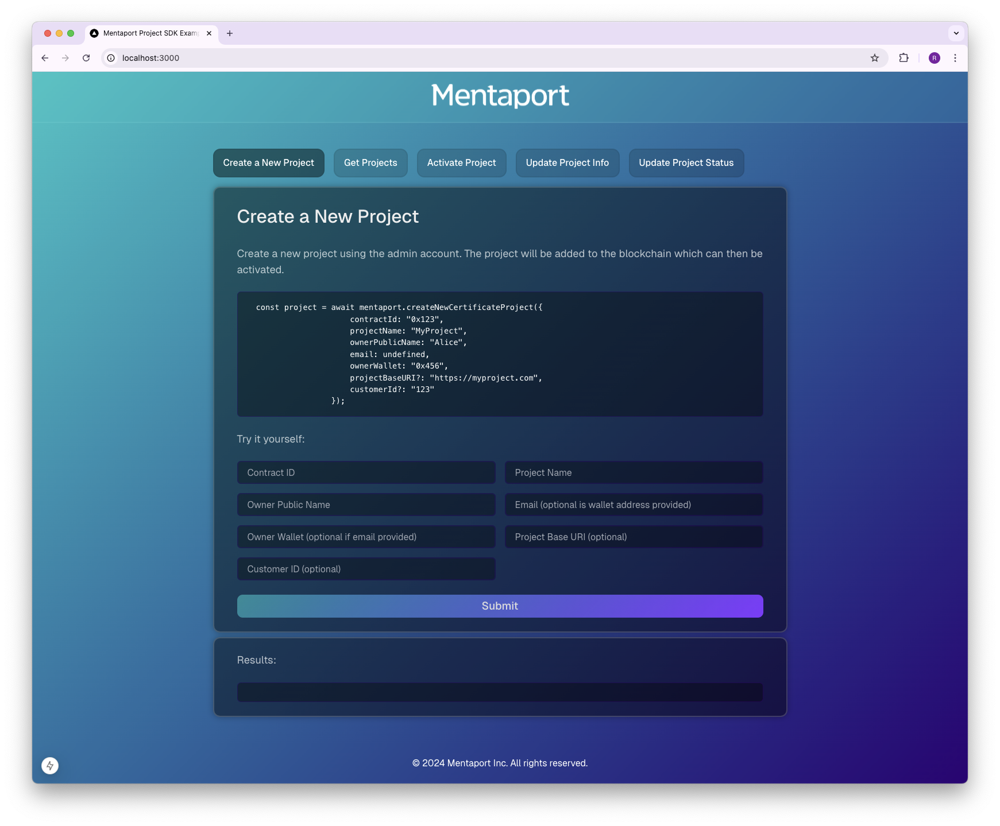
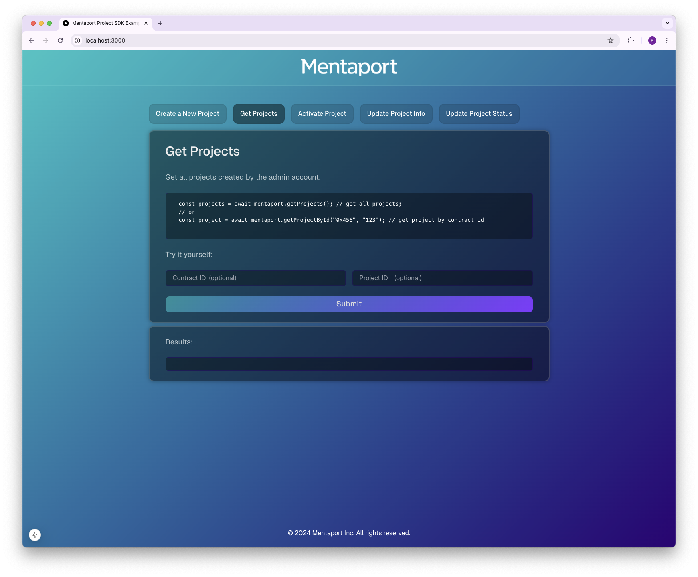
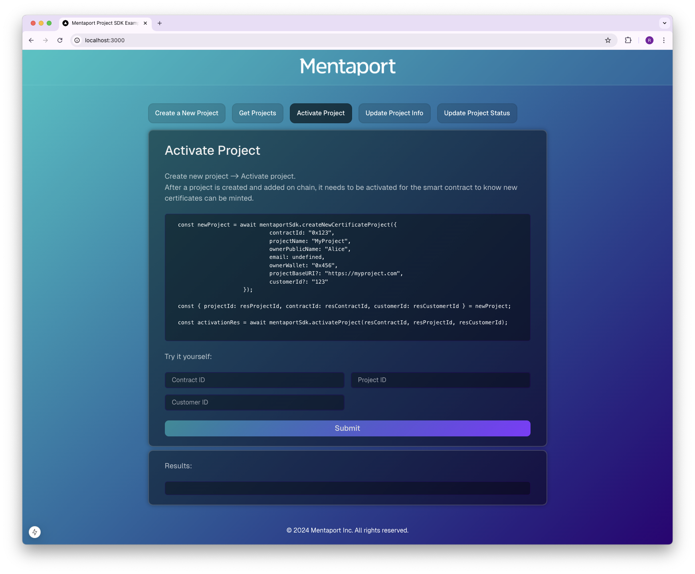
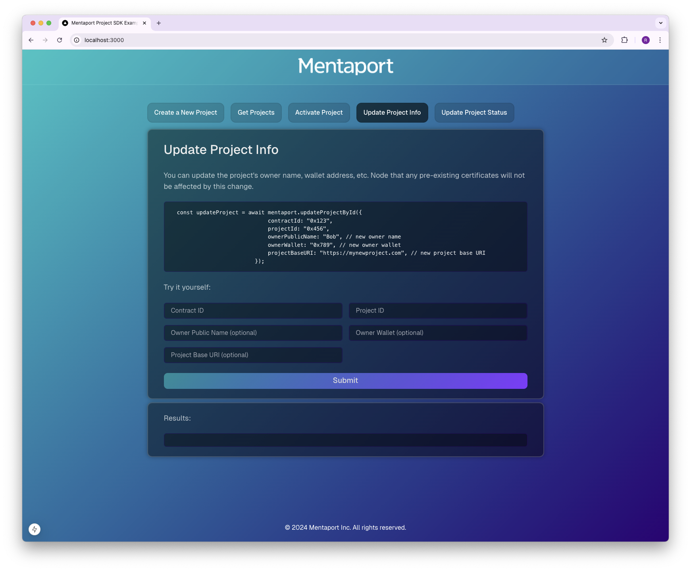
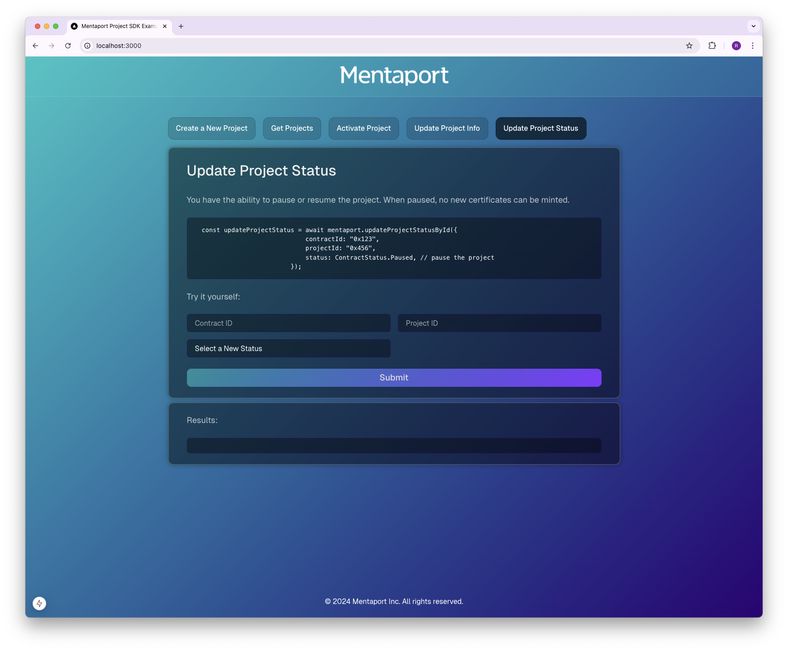

<div align="center">
  
</div>

# Mentaport NextJS Projects SDK Example

This is a [Next.js](https://nextjs.org) project bootstrapped with [`create-next-app`](https://nextjs.org/docs/app/api-reference/cli/create-next-app) showing example usage of Mentaport's official Projects SDK.

You will find how to initialize the SDK, call all the main functions, and visualize the results inside 
`src/app/actions/mentaport`. Code for UI and input handling can be found inside `src/components/example-section`.

>Using SDK Version: [`1.0.0-alpha.2`](https://www.npmjs.com/package/@mentaport/certificates-projects)
>NodeJS: v20.11.0+

## Environment Variables

To run this project properly, you will need to add the following environment variables to your `.env` file. You can get all variables from your Settings Page in the Mentaport Certificate App website.

```
NEXT_MENTAPORT_API_KEY=your_api_key
```


## Run the Example Locally

Go to the project directory

```bash
  cd packages/nextjs-projects-example
```

Install dependencies

```bash
  npm install
    # or
  yarn install
```


Start the server

```bash
  npm run start
    # or
  yarn start
```

To interact with the Example, open [http://localhost:3000](http://localhost:3000) with your browser. 

## Example Usage

There are 5 SDK usage examples to interact with.

    1. Create a New Project
    2, Get All/Specific Projects
    3. Get Contracts Created/Used by your Team
    3. Activate a Newly Created Project
    4. Update a Project's Information
    5. Update a Project's Status

### Creating a New Project

This example lets you interact will all required and optional parameters to create a new project using your API Key.




### Getting All or Specific Projects

This example lets you interact with fetching all projects if called without parameters or fetching specific projects using the project's Project ID or Contract ID.



### Getting Active/All Contracts Belonging to Your Team

This example lets you try fetching your team's active and inactive contracts.
1[get contracts example](img/example-get-contracts.png)

### Activating a Newly Created Project

This example demonstates how to activate a project that has recently been created.




### Updating Project Information

This example demonstates an example use case of updating a project's supplementary information such as base URI, owner wallet address, or owner name.




### Fetching A User's Contract(s)

This example demonstates an example usage and results of pausing or resuming a project.




## Support

[Mentaport Documentation](https://docs.mentaport.com)
